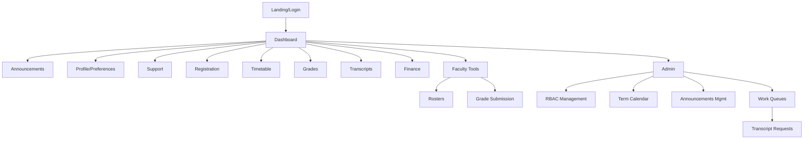
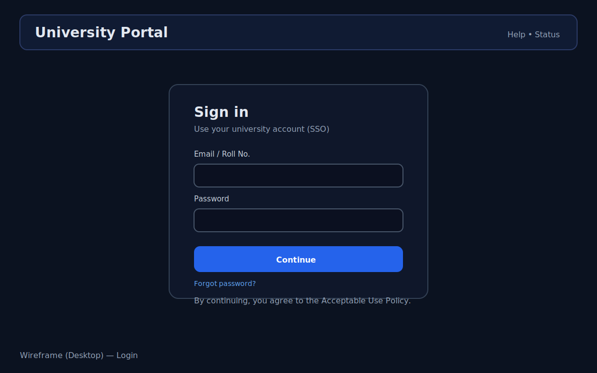
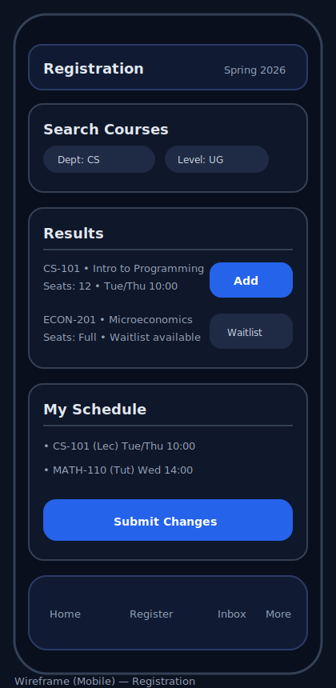
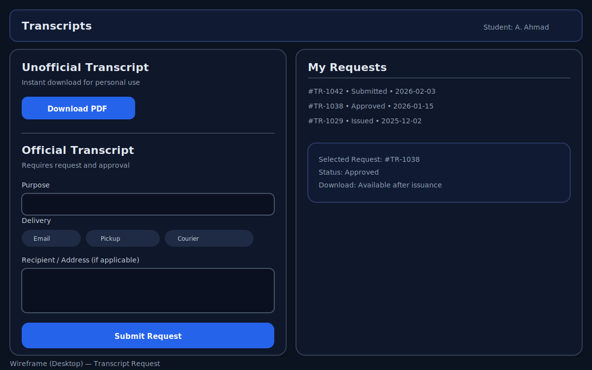
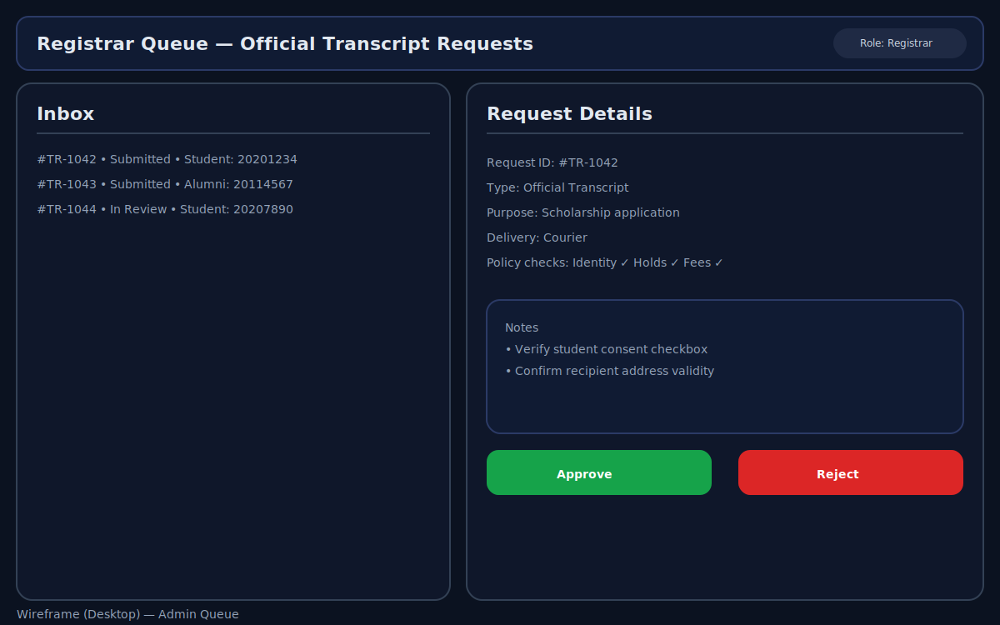
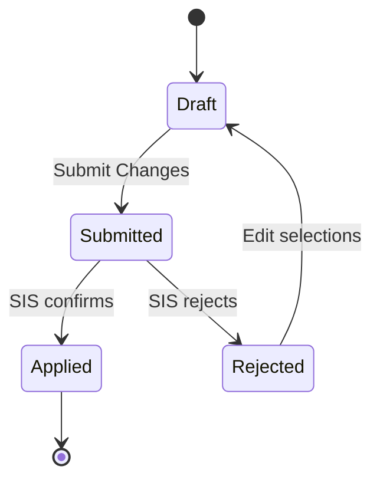
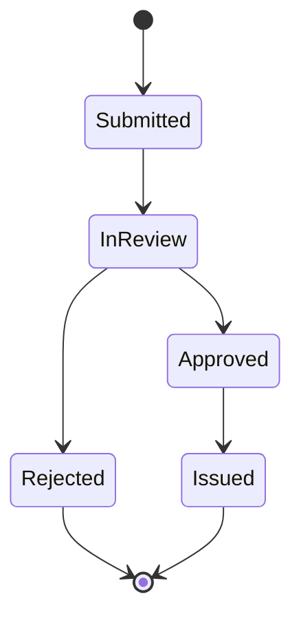
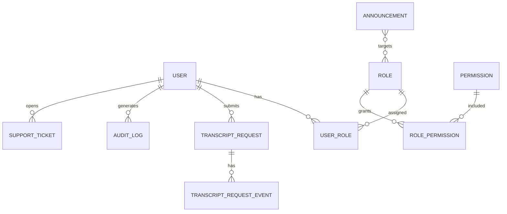

# Design Document
## University Portal (LUMS-like) — SDLC Step (b) Design

**Document ID:** DES-UP-001  
**Version:** 1.0  
**Date:** 2026-02-05  
**Related SRS:** [docs/SRS_University_Portal_IEEE830.md](SRS_University_Portal_IEEE830.md)

---

## 1. Design Goals
- Deliver a secure, responsive university portal that runs well on desktop and mobile browsers (Android/iOS).
- Support all roles defined in the SRS (Student, Faculty, Staff, Registrar Staff, Finance Staff, IT/Admin, Alumni).
- Integrate with SIS (mandatory) and also Finance + LMS where available.
- Provide official transcript request/approval workflow with strong auditability.
- Meet usability/accessibility targets (WCAG 2.1 AA) and standards-based security targets (OWASP ASVS L2).

## 2. Scope and Assumptions
### 2.1 In Scope (Design)
- Application architecture and module boundaries
- UI information architecture, navigation, and wireframes
- Data model (portal-owned vs external/system-of-record)
- Key workflows and state machines (registration, grading, transcript request)
- Integration approach (SSO, SIS, Finance, LMS)
- Security architecture and controls
- Observability, audit logging, and operational concerns

### 2.2 Key Assumptions
- Identity Provider exists for SSO using OIDC or SAML.
- SIS exposes APIs (preferred) or batch exports.
- Finance and LMS integrations may be partial at MVP; design supports progressive integration.

---

## 3. Architecture Overview

### 3.1 Context Diagram
```mermaid
flowchart LR
  U[Users\nStudents/Faculty/Staff/Admin/Alumni] -->|Browser HTTPS| FE[Portal Web UI]
  FE -->|HTTPS| BE[Portal Backend API]
  BE -->|OIDC/SAML| IDP[University IdP / SSO]
  BE -->|API/Batch| SIS[SIS\n(Enrollments, Grades, Holds)]
  BE -->|API/Batch| FIN[Finance System\n(Fee status)]
  FE -->|SSO Deep Links| LMS[LMS\n(Course content)]
  BE -->|Email| EMAIL[SMTP/Email Provider]
  BE --> DB[(Portal DB\nRBAC, prefs, audit, requests)]
```

### 3.2 Logical Component Architecture
- **Front-End (FE):** responsive SPA/MPA hybrid (implementation choice later), role-based navigation, accessibility-first components.
- **Backend API (BE):** domain services for registration, grades submission, transcript workflow, announcements, support tickets.
- **Integration Layer:** adapters per upstream system (SIS/Finance/LMS) with retry, backoff, and idempotency.
- **Data Layer:** portal-owned relational DB for RBAC, preferences, workflow states, audit logs.
- **Observability:** structured logs, metrics, tracing, alerting, and audit log pipeline.

### 3.3 Deployment Topology (Target)
```mermaid
flowchart TB
  CDN[CDN + WAF] --> FE[Static Web Assets]
  CDN --> API[API Gateway / Load Balancer]
  API --> SVC[Backend Service\n(Containers)]
  SVC --> DB[(PostgreSQL)]
  SVC --> CACHE[(Redis optional)]
  SVC --> IDP[IdP/SSO]
  SVC --> SIS[SIS]
  SVC --> FIN[Finance]
  SVC --> EMAIL[Email Provider]
```

---

## 4. Information Architecture (IA)

### 4.1 Primary Navigation
Role-based navigation: items appear only if role/permission allows.
- Dashboard
- Registration (Student)
- Timetable (Student)
- Grades (Student/Faculty)
- Transcripts (Student/Alumni/Registrar)
- Announcements (All + Admin management)
- Finance (Student/Finance)
- Support (All)
- Admin (IT/Admin)

### 4.2 Sitemap (High Level)


---

## 5. UI/UX Design

### 5.1 Visual Design System (Proposed)
- Typography: system UI / Inter-like, 14–16px base
- Layout: 12-column grid desktop; single column mobile
- Components: cards, tables, filters, status chips, dialogs
- Color: high contrast; support optional dark mode

### 5.2 Responsive Breakpoints
- Mobile: 320–480px
- Tablet: 481–1024px
- Desktop: 1025px+

### 5.3 Accessibility Requirements (Design)
- Semantic HTML landmarks, correct heading structure
- Focus states for all interactive controls
- Keyboard operability for all core flows
- Color contrast meeting WCAG AA
- Screen-reader friendly form fields and errors

### 5.4 Wireframe Images
These are SVG wireframes stored in `docs/design/images/`.

- Login (Desktop): 
- Dashboard (Desktop): 
- Registration (Mobile): 
- Transcript Request (Desktop): 
- Registrar Queue (Desktop): 

---

## 6. Core Workflows

### 6.1 Authentication (SSO)
- FE redirects to IdP (OIDC/SAML).
- BE validates identity token / assertion.
- BE maps identity to portal user record and roles.
- Session established with secure cookies.

### 6.2 Course Registration (Student)
Design considerations:
- Registration windows enforced using term calendar.
- Rule checks delegated to SIS where possible; portal performs pre-checks where safe.
- Conflicts displayed clearly; submission is transactional.

State (simplified):


### 6.3 Grade Submission (Faculty)
- Faculty can save draft grades.
- Final submit triggers locking and audit.
- Optional: upload CSV with validations.

### 6.4 Official Transcript Request & Approval
- Student/Alumni submits request with metadata and consent.
- Registrar reviews, checks holds/fees/identity.
- Approve or reject with reason.
- Issuance produces tamper-evident PDF and audit trail.

State machine:


---

## 7. Data Design

### 7.1 Data Ownership
- **System of record:** SIS (enrollments, grades), Finance (fees), LMS (course content)
- **Portal-owned:** roles/permissions, preferences, announcements metadata (if not in SIS), support tickets, transcript request workflow, audit logs

### 7.2 Core Entities (Portal DB)
Proposed entities:
- `User` (id, externalId, name, email, status)
- `Role` / `Permission` / `UserRole`
- `Announcement` (target roles, publish window)
- `Notification` (inbox items)
- `TranscriptRequest` (requester, type, purpose, delivery, status)
- `TranscriptRequestEvent` (status transitions, actor, timestamp, reason)
- `AuditLog` (actor, action, entity, metadata, ip, userAgent)
- `SupportTicket` (category, status, messages)

ERD (logical):


### 7.3 Audit Log Design
- Append-only, immutable records.
- Separate retention and access controls.
- Sensitive document access logged (who/when/what).

---

## 8. Integration Design

### 8.1 Identity Provider (SSO)
- Preferred: OIDC (Auth Code + PKCE on FE; token exchange/validation on BE).
- Alternate: SAML 2.0.
- Roles can be mapped via claims/groups or maintained in portal.

### 8.2 SIS Adapter
- Read: term catalog, offerings, timetable, grades release, holds.
- Write: registration submissions (add/drop), grade submission (if SIS is SoR).
- Resilience: retries, idempotency keys for write operations.

### 8.3 Finance Adapter
- Read-only: fee invoice status, due dates, holds/blocks.

### 8.4 LMS Integration
- SSO deep links into course pages.
- Optional sync: course roster/enrollment alignment.

---

## 9. Security Design

### 9.1 Threat Model (High Level)
- Account takeover / session hijacking
- Unauthorized access to academic records and documents
- Injection and XSS
- CSRF
- Privilege escalation (RBAC bypass)
- Sensitive PDF link leakage

### 9.2 Controls
- HTTPS everywhere, HSTS, secure cookies
- RBAC in BE with centralized authorization checks
- CSRF protections, input validation, output encoding
- Rate limiting and abuse detection
- Separation of duties (e.g., transcript issuance) and mandatory audit
- Document access via short-lived signed URLs or authenticated download endpoint

---

## 10. Observability and Operations
- Structured application logs (PII minimized)
- Metrics: latency, error rates, upstream dependency health
- Tracing for critical workflows (registration, transcript issuance)
- Alerting: outage detection, dependency degradation, suspicious activity

---

## 11. Design Risks and Mitigations
- Upstream API instability → adapter layer + caching + fallbacks
- Peak load during registration → load testing + auto-scaling + queueing
- Privacy risk → strict RBAC + auditing + least privilege

---

## 12. Next SDLC Steps
- (c) Code: scaffold FE/BE project, implement RBAC, auth, and transcript workflow first.
- (d) Test: unit + integration tests; security testing (OWASP-focused).
- (e) Improve: performance, accessibility, UX polish.
- (f) Deploy: CI/CD and environment promotion.
